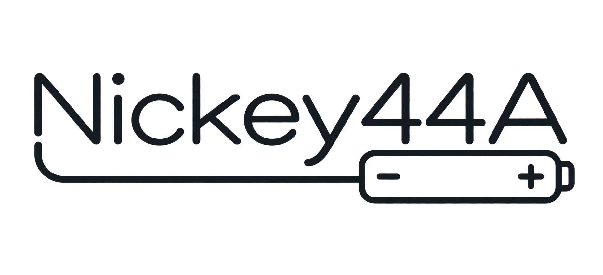
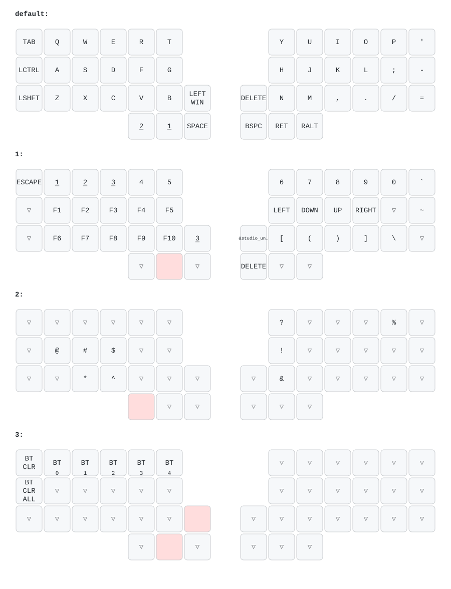

  

# zmk-config-nickey44a

分割40%ワイヤレス自作キーボード **「Nickey44A」** のZMK Firmware設定リポジトリです。

## Nickey44Aについて

- 44キーのオーソリニア配列を採用した左右分割キーボード
- Bluetooth対応の完全ワイヤレス設計
- Choc v2スイッチ対応のロープロファイル設計
- 単4電池で動作
- ボトムからトッププレートまで6.5mmの薄型設計
- 電池、キースイッチキャップ込で222gの軽量仕上げ

BOOTHでは、キット版と完成品を取り扱っています。

- [Nickey44A キット版](https://potamega.booth.pm/items/8744351)
- [Nickey44A 完成品](https://potamega.booth.pm/items/8744204)

セットアップ、ファームウェアの書き込み、Bluetoothペアリングなどの詳しい手順は、[Nickey44A ビルドガイド](https://nixiy.github.io/nickey-docs/nickey44a/)を参照してください。

---

## 現在のキーマップ

---

## ⌨️ キーマップの変更方法 (Keymap Editor)

Web GUIツール **[Keymap Editor](https://nickcoutsos.github.io/keymap-editor/)** を使うと、コードを直接編集せずにブラウザ上でキーマップを変更できます。

1. 本リポジトリを自身のGitHubアカウントに Fork します。
2. [Keymap Editor](https://nickcoutsos.github.io/keymap-editor/)でForkしたリポジトリを選択し、キーマップを編集して保存します。
3. Commit / Push 後、GitHub Actions がファームウェアを自動ビルドします。

Forkの初回設定や詳しい編集手順は、[キーマップの変更方法](https://nixiy.github.io/nickey-docs/guides/keymap/)を参照してください。

> 💡 **コードを直接編集する場合:**  
> リポジトリ内の `config/nickey44a.keymap` を直接編集して Commit / Push することでも変更可能です。

---

## 🛠️ ファームウェアのビルドと書き込み方法 (Flashing)

Keymap Editorでの変更をCommit（または `main` ブランチへPush）すると、GitHub Actions がファームウェアを自動ビルドします。完了後、Actions の最新ワークフローから `firmware` をダウンロードしてください。

書き込みの詳しい手順は、[Firmwareの書き込み方法](https://nixiy.github.io/nickey-docs/guides/firmware/)を参照してください。左右のペアリングや設定リセットについては、[Nickey44A ビルドガイド](https://nixiy.github.io/nickey-docs/nickey44a/)を確認してください。

---

## IQS7211E Trackpad（experimental）

右手側のみ、sekigon-gonnoc IQS7211E low-power circular trackpad を実験的にサポートします。

- I2C address: `0x56`
- 現在の切り分け用配線: SDA = D0 / P0.02、SCL = D1 / P0.03、RDY = D2 / P0.28
- D1/D2をTrackpadへ再割り当てする切り分けのため、右側キーマトリクスの先頭2列はP1.00/P1.10へ一時退避しています。この状態ではD1/D2列のキーは動作しません。
- VCC: XIAO 3V3
- GND: FFC Pin 3
- FFC Pin 6: 意図的にNC（未接続）

同一電極面FFCでは、対向コネクタ側でpin orderが反転します。電源投入前に、必ずFFCの向きを確認してください。Pin 6をNCにしても、逆挿しに対する完全な保護にはなりません。

---

## 📄 ライセンス

This repository is licensed under the MIT License - see the [LICENSE](LICENSE) file for details.

### 第三者ライセンス

Nickey44A の昇圧回路は、cormoran 氏が [DYA Dash の回路設計解説](https://note.com/cormoran/n/n1e45fe7471d8) で紹介している、各種保護機能付き昇圧回路を参考にしています。DYA Dash の回路図（`*.kicad_sch`）は MIT License で提供されています。

- Copyright (c) 2025 cormoran
- ライセンス全文: [THIRD_PARTY_NOTICES.md](THIRD_PARTY_NOTICES.md)
